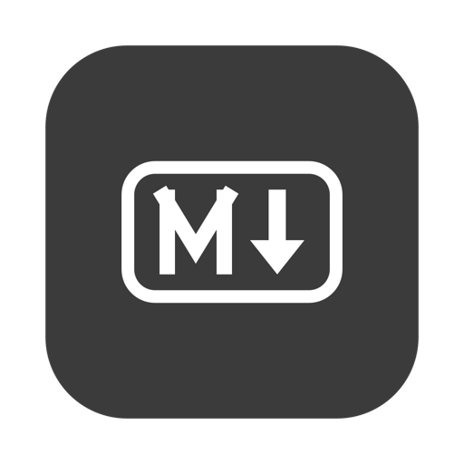

<p align="center">
  
</p>

<h1 align="center">MarkdownViewer</h1>

<p align="center">
  <a href="https://github.com/nmelo/MarkdownViewer/releases/latest"></a>
  <a href="https://github.com/nmelo/MarkdownViewer/releases"></a>
  <a href="./LICENSE"></a>
  
  
  <a href="https://github.com/nmelo/MarkdownViewer/releases/latest"></a>
</p>

A standalone macOS markdown viewer with live file reload. Opens a `.md` file, renders it, and re-renders automatically on every save.


Fork of [sbarex/QLMarkdown](https://github.com/sbarex/QLMarkdown), trimmed down from a Quick Look extension into a plain app.

## Download

Grab the latest signed and notarized build from the [Releases page](https://github.com/nmelo/MarkdownViewer/releases/latest):

```sh
unzip MarkdownViewer-vX.Y.Z.zip
mv MarkdownViewer.app /Applications/
```

That's it — no Gatekeeper warning, no `xattr` ritual. Double-click any `.md` file in Finder, or `open -a MarkdownViewer file.md` from the terminal.

## Open a file

- Finder: double-click or right-click → Open With
- Terminal: `open -a MarkdownViewer file.md`
- Drag-and-drop onto the window

## Build from source

Required if you're hacking on it. Needs Xcode 26 and `cmake` for the bundled cmark-gfm. Clone with `--recurse-submodules` so the renderer dependencies come along.

```sh
git clone --recurse-submodules https://github.com/nmelo/MarkdownViewer
cd MarkdownViewer
xcodebuild -project MarkdownViewer.xcodeproj \
  -scheme MarkdownViewer \
  -configuration Release \
  CODE_SIGN_IDENTITY="-" CODE_SIGN_STYLE=Manual \
  ONLY_ACTIVE_ARCH=YES build
```

The product lands in `~/Library/Developer/Xcode/DerivedData/MarkdownViewer-*/Build/Products/Release/MarkdownViewer.app`. Drop it in `/Applications`, then `codesign --force --sign - --deep` it for local launch.

## License

GPL-3.0 — see [`LICENSE`](./LICENSE).

The Swift code in this repository started as a derivative of [sbarex/QLMarkdown](https://github.com/sbarex/QLMarkdown) (MIT), which the MIT license allows us to relicense. The combined work is GPL-3.0 because the syntax-highlighting library it links against ([saalen/highlight](https://gitlab.com/saalen/highlight)) is GPL-3.0.
